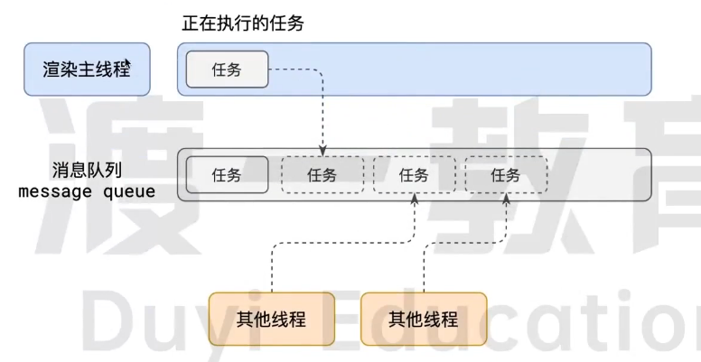

# 事件循环机制

**进程：** 可以简单的将运行内存理解为进程

**线程：** 每个进程中执行代码的部分为线程

**浏览器中的进程：** 

- 浏览器进程：

  主要负责界面显示、用户交互、子进程管理

- 网络进程

  负责加载网络资源

- 渲染进程

  渲染进程启动后，会开启一个渲染主进程，负责执行`HTML`、`CSS3`、`JS `代码

## 浏览器如何调度任务

问题：

- 我正在执行一个` JS` 函数，执行到一半的时候用户点击了按钮，我该立即去执行点击事件的处理函数吗?
- 我正在执行一个` JS `函数，执行到一半的时候某个计时器到达了时间，我该立即去执行它的回调吗?
- 浏览器进程通知我“用户点击了按钮”，与此同时，某个计时器也到达了时间，我应该处理哪一个呢?

解决：**排队**



1. 在最开始的时候，渲染主线程会进入一个无限循环
2. 在每一次的循环中会检查消息队列中是否有任务，如果有就取出第一个任务执行，执行完毕后进入下一次循环，若没有，则进入休眠
3. 所有的线程都可以随时向消息队列添加任务。新任务添加到末尾。

称为事件循环`event loop` (消息循环`message loop`)

## 面试题

> 阐述一下JS的事件循环

参考答案:
事件循环又叫做消息循环，是浏览器渲染主线程的工作方式。在 `chrome` 的源码中，它开启一个不会结束的 for 循环，每次循环从消息队列中取出第一个任务执行，而其他线程只需要在合适的时候将任务加入到队列未尾即可。过去把消息队列简单分为宏队列和微队列，这种说法目前已无法满足复杂的浏览器环境，取而代之的是一种更加灵活多变的处理方式。
根据 `W3C` 官方的解释，每个任务有不同的类型，同类型的任务必须在同一个队列，不同的任务可以属于不同的队列。不同任务队列有不同的优先级，在一次事件循环中，由浏览器自行决定取哪一个队列的任务。但浏览器必须有一个微队列，微队列的任务一定具有最高的优先级，必须优先调度执行

> `js` 中的计时器能做到精确计时吗

不行，

1. 计算机的时间利用的是寄存器实现的，无法做到原子钟的精确计时
2. 操作系统的计时函数本身就会有一点偏差，同时 `js` 的计时器最终调用的就是操作系统的函数，所以也会有偏差
3. 按照 `W3C` 的标准，浏览器实现计时器的时候，如果嵌套超过 5 层，就会带有最少 4 毫秒的延迟，在计时时间少于 4 毫秒的时候也带来了偏差
4. 受事件循环的影响，计时器的回调函数只能在主线程空闲的时候运行，因此当主线程中任务没结束并且计时已完成的时候，并不会立即执行计时器的回调函数，也会带来偏差

## 总结

**单线程是异步产生的原因**

**事件循环是异步的实现方式**

# 浏览器渲染原理

`render`：渲染，把`HTML`字符串渲染成像素信息

## 浏览器是如何渲染页面的？

当浏览器的网络线程收到`HTML`文档后，会产生一个渲染任务，并将其传递给渲染主线程的消息队列。在事件循环机制的作用下，渲染主线程取出消息队列中的渲染任务，开启渲染流程

------

`HTML`字符串 → 解析 `HTML`  → 样式计算 → 布局 → 分层 → 绘制 → 分块 → 光栅化 → 画 → 像素信息

- 1、解析HTML--- `Parse HTML`

生成DOM树 `Document Object Model` 


生成`CSSOM`树 `CSS Object Model` 


HTML解析过程中遇到 `CSS` 代码时，浏览器会启动一个预解析器率先下载和解析`CSS`。`JS也是要预下载`

如果主线程解析到 `Link` 位置，此时外部的 `CSS` 文件还没有下载解析好，主线程不会等待，而是继续解析后续的 `HTML` 。这是因为下载和解析 `CSS` 的工作是在与解析线程中进行的。这就是 `CSS` 不会阻塞 `HTML` 解析的根本原因。

如果主线程解析到 `Script` 位置，会停止解析 `HTML` ，转而等待 `JS` 文件下载完毕，并将全局代码解析执行完成后，才能继续解析 `HTML` 。这是因为 `JS` 代码在执行过程中可能会修改当前 `DOM` 树，所以 `DOM` 树的生成必须暂停。这就是 `JS` 会阻塞 `HTMl` 解析的根本原因

- 2、样式计算 — `Recalculate Style`

主线程会遍历得到的 `DOM` 树，以此为树中的每一个节点计算出他最终的样式，称为 `Compouted Style` 。在这过程中，很多的预设值会变成绝对值，比如 `red` 会变成 `rgb(255,0,0)` ；相对单位会变成绝对单位，比如 `em`  变成 `px` 

这一步完成后，会得到一颗带有央视的 `DOM` 树。

- 3、布局

接下来是布局，布局完成后会得到布局树。
布局阶段会依次遍历 `DOM` 树的每一个节点，计算每个节点的几何信息。例如节点的宽高、相对包含块的位置。
大部分时候，DOM 树和布局树并非一 一对应
比如 `display:none` 的节点没有几何信息，因此不会生成到布局树;又比如使用了伪元素选择器，虽然 DOM树中不存在这些伪元素节点，但它们拥有几何信息，所以会生成到布局树中。还有匿名行盒、匿名块盒等等都会导致 DOM树和布局树无法一 一对应。

行盒块盒：文本内容必须在行盒中，行盒和块盒不能相邻

- 4、分层

下一步是分层
主线程会使用一套复杂的策略对整个布局树中进行分层
分层的好处在于，将来某一个层改变后，仅会对该层进行后续处理，从而提升效率滚动条、堆叠上下文、`transform`、`opacity `等样式都会或多或少的影响分层结果，也可以通过 `will-change` 属性更大程度的影响分层结果

- 5、绘制

主线程会为每一个层单独产生绘制指令集，用来描述这一层的内容是如何画出来的

完成绘制之后，主线程将每一个涂层的绘制信息提交给合成线程，剩余工作将由合成线程完成

- 6、分块

合成线程首先对每一个图层进行分块，将其划分为更多的小区域

浏览器会从线程池中拿取多个线程完成分块工作

- 7、光栅化- `Raster` 

光栅化是将每个块变成位图（每个像素点信息，二位数组）

合成线程会将快信息交给 `GPU` 进程，高速完成光栅化

`GPU` 进程会开启多个线程来完成光栅化，并且优先处理靠近视口区域的块

光栅化的结果，就是一块一块的位图

- 8、画

合成线程拿到每一个层、块的位图后，生成一个个的 `指引quad` 信息

指引会标识出每个位图应该画到屏幕的哪个位置，以及会考虑到旋转、缩放等变形

变形发生在合成线程，与渲染主线程无关，这就是 `transform` 效率高的本质原因


h合成线程会把 `quad` 提交给 `GPU` 进程，由 `GPU` 进程产生系统调用，提交给 `GPU` 硬件，完成最终的屏幕成像

## 什么是 `reflow` 回流

`reflow` 的本质就是重新计算 `layout` 树

当进行了会影响布局树的操作后，需要重新计算布局树，就会引发 `layout` 

为了避免连续的多次操作导致布局树反复计算，浏览器会合并这些操作，当 `JS ` 代码全部完成后再进行统一计算。所以，改动属性造成的 `reflow` 是异步完成的

也同样，当 `JS ` 获取布局属性时，就可能造成无法获取到最新的布局信息。因此获取到属性会立即 `reflow` 

## 什么是 `repaint` ? 重绘

`repaint ` 的本质就是重新根据分层信息计算了绘制指令

当改动了可见样式后，就需要重新计算，会引发 `repaint`。

由于元素的布局信息也属于可见样式，所以 `reflow `一定会引起 `repaint`。


## 为什么 `transform ` 的效率高?

因为 `transform  ` 既不会影响布局也不会影响绘制指令，它影响的只是染流程的最后一个 `draw` 阶段由于 `draw ` 阶段在合成线程中，所以 `transform ` 的变化几乎不会影响渲染主线程。反之，渲染主线程无论如何忙碌，也不会影响 `transform ` 的变化。

 `JS `控制的除外

# 属性标识符


# vue常见优化手段

- 使用key

添加唯一标识符，稳定且唯一，建议使用 `id` 

- 使用冻结对象

被冻结之后的对象不会被响应化，减少不必要的操作

- 使用函数式组件

可以参考函数式组件

- 使用计算属性

可以缓存，依赖变化，数据也会变化

- 非实时绑定的表单项

`v-model` 会导致 `vue` 发生重渲染（ `rerender` ）

可以使用 `lazy` 或者不使用 `v-model` 的方式解决该问题，但是会发生数据不一致

- 保持对象引用稳定

在绝大部分情况下， `vue` 触发 ` rerender` 的时机是其依赖的数据发生变化

如果数据没有发生变化，就算是数据被重新赋值了，`vue`  也是不会做出任何处理

```typescript
function hasChanged(x: unkown, y: unkown) :boolen {
    if(x === y) {
        return x === 0 && 1 /x !== 1/y
    } else {
        return x === x || y === y
    }
}
```

 只要保证组建的依赖数据不会发生变化，组件就不会重新渲染

原始数据类型，保持值不变即可

对象类型，保持引用不变

- 使用 `v-show` 代替 `v-if`

 需要反复的加载，使用 `v-show` ，反之 `v-if`

- 使用延迟装载（defer）

`defer.js`

```typescript
import { Component, Vue } from 'vue-property-decorator';

@Component
export default class FrameControl extends Vue {
  private frameCount: number = 0;

  public mounted() {
    const refreshFrameCount = () => {
      requestAnimationFrame(() => {
        this.frameCount++;
        if (this.frameCount < this.maxFrameCount) {
          refreshFrameCount();
        }
      });
    };
    refreshFrameCount();
  }

  public defer(showInFrameCount: number): boolean {
    return this.frameCount >= showInFrameCount;
  }

  private get maxFrameCount(): number {
    return this.$props.maxFrameCount || 60;
  }
}
```

这个代码使用了 `Vue Property Decorator` 库提供的装饰器语法，用于更方便地编写 `Vue` 组件。具体来说：

- 我们使用 `@Component` 装饰器将类标记为 `Vue` 组件。
- `frameCount` 属性不再需要在`data`方法中定义，而是直接作为类的私有属性。
- 在mounted生命周期钩子函数中，我们定义了 `refreshFrameCount` 方法，它通过 `requestAnimationFrame `方法不断地更新 `frameCount` 属性的值，直到达到 `maxFrameCount` 的值为止。
- `defer`方法的参数类型被指定为 `number` 类型。
- 我们使用`getter`方法来获取`maxFrameCount`属性的值，从而避免直接访问`props`属性。

下面是使用这个组件的示例代码：

```vue
<template>
  <div>
    <div v-if="defer(30)">这个内容将在第30帧时显示</div>
    <div v-if="defer(60)">这个内容将在第60帧时显示</div>
  </div>
</template>

<script lang="ts">
import { Component, Vue } from 'vue-property-decorator';
import FrameControl from '@/components/FrameControl.vue';

@Component
export default class MyComponent extends Vue {
  private get maxFrameCount(): number {
    return 120;
  }
}
</script>
```

在这个示例中，我们引入了上面定义的`FrameControl`组件，并将其作为父组件的子组件来使用。我们通过`getter`方法来获取最大帧数的值，并传递给`FrameControl`组件。在模板中使用defer方法来控制需要显示的内容。例如，当`frameCount`达到30时，第一个`div`就会显示出来，当`frameCount`达到60时，第二个div也会显示出来。

- 使用keep-alive
- 长列表优化
- 打包体积优化


